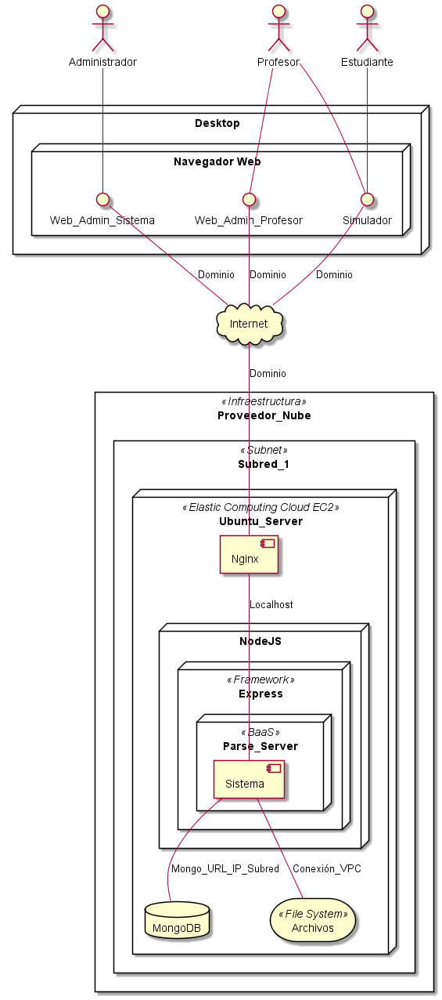

== Diagrama de Arquitectura

== Descripción de la Arquitectura del Sistema

=== Descripción
Dentro de la propuesta otorgada para la arquitectura del sistema se propone el uso de un servidor increlmental de recursos como plataforma central de almacenamiento de la: Plataforma, Base de Datos y Documentos. Lo anterior de tal manera y en estructura para permitir un correcto funcionamiento, crecimiento y adaptación a futuros cambios, esto para una adaptación horizontal o vertical según sea conveniente para el futuro del proyecto.

=== Componentes Básicos

==== Ubuntu Server
Este sistema operativo para servidores, permite el manejo de la aplicación, utilizando UNIX como sistema, la generalización de componentes básicos de arquitectura como lenguaje, compilación, administración, seguridad, estabilidad y escalabilidad.

===== Beneficios
* Escalabilidad
* Seguridad
* Simplicidad
* Personalización
* Compatibilidad

==== NodeJS
Lenguaje de programación generado a partir de Javascript, este lenguajes como subconjunto del anterior, incorpora una modularización específica para servidores, como son manejo de paquetes, sockets, estructura cliente-servidor, entre otros.

===== Beneficios
* Escalabilidad
* Seguridad
* Simplicidad
* Fácil curva de aprendizaje

==== Express (Framework)
Librería parte del ambiente de NodeJS, permite crear arquitecturas de sistema a travér de MVC (Modelo Vista Controlador), esta arquitectura será la predominante en el sistema y permite generar un mayor orden en la construcción de sistemas de software complejos.

===== Beneficios
* Escalabilidad
* Estandarización
* Fácil curva de aprendizaje

==== Parse Server (BaaS)
Librería parte del ambiente de NodeJS, funciona como Backend As A Service el cual simplifica la comunicación entre controladores con la Base de Datos a través de SDKs de uso específico como son Javascript para entorno Web y como será desarrollado el proyecto, también para crecimiento a futuro como es Android, iOS en case de desarrollo para entornos móviles o Unity para conexión con entornos de videojuegos para el caso específico de la simulación.

===== Beneficios
* Unificación de lenguajes utilizados para desarrollo
* Entorno unificado de desarrollo, base de datos
* Reducción de tiempos de desarrollo

==== MongoDB
Sistema de Base de Datos de código abierto que utiliza un esquema no relacional para su arquitectura. Al tener compatibilidad con Parse, se usa como facilidad para almacenamiento de los datos generados por la aplicación, pese a tener su propio lenguaje de manipulación, se utilizara el otorgado por Parse para su manipulación.

===== Beneficios
* Uso de estándar JSON
* Esquema no relacional
* Código abierto